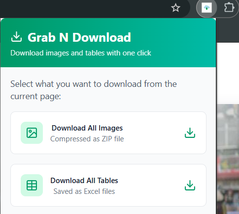

# Grab N Download

A powerful Chrome extension that allows you to download all images and tables from any webpage with just one click.



## Features

- 🖼️ **Bulk Image Download**

  - Downloads all images from the current webpage
  - Filters out small images and SVG icons
  - Automatically compresses images into a ZIP file
  - Preserves original image formats
  - Names files systematically for easy organization

- 📊 **Table Export**

  - Extracts all HTML tables from the webpage
  - Converts tables to Excel format (.xlsx)
  - Maintains table structure and formatting
  - Packages multiple tables into a single ZIP file
  - Names files based on page title for easy reference

- 🎯 **Smart Filtering**

  - Ignores small icons and decorative images
  - Focuses on meaningful content
  - Minimum size threshold for images (50x50px)

- 📱 **User-Friendly Interface**
  - Clean, modern design
  - Real-time download progress indicators
  - Download summary statistics
  - Error handling with clear user feedback
  - Desktop notifications for completed downloads

## Installation

1. Download the extension from the Chrome Web Store (link coming soon)
2. Click "Add to Chrome" to install
3. The extension icon will appear in your browser toolbar

## Usage

1. Navigate to any webpage containing images or tables you want to download
2. Click the Grab N Download icon in your Chrome toolbar
3. Choose either:
   - "Download All Images" to save images as a ZIP file
   - "Download All Tables" to save tables as Excel files
4. Your downloads will begin automatically
5. Check your downloads folder for the saved files

## Technical Details

- Built with React and TypeScript
- Uses modern Chrome Extension Manifest V3
- Implements JSZip for file compression
- Utilizes XLSX library for Excel file generation
- Features background service worker for notifications

## Privacy & Permissions

The extension requires the following permissions:

- `activeTab`: To access the current webpage
- `storage`: For saving user preferences
- `downloads`: To save files to your computer
- `notifications`: For download completion alerts

Note: This extension does not collect any user data or communicate with external servers.

## Development

To set up the development environment:

```bash
# Clone the repository
git clone [repository-url]

# Install dependencies
npm install

# Build the extension
npm run build

# Load the extension in Chrome:
# 1. Open chrome://extensions/
# 2. Enable "Developer mode"
# 3. Click "Load unpacked"
# 4. Select the `dist` folder
```

## Contributing

Contributions are welcome! Please feel free to submit a Pull Request.

## License

MIT License - feel free to use this code in your own projects.

## Support

If you encounter any issues or have questions, please open an issue in the GitHub repository.

---

Made with ❤️ by [Your Name]
